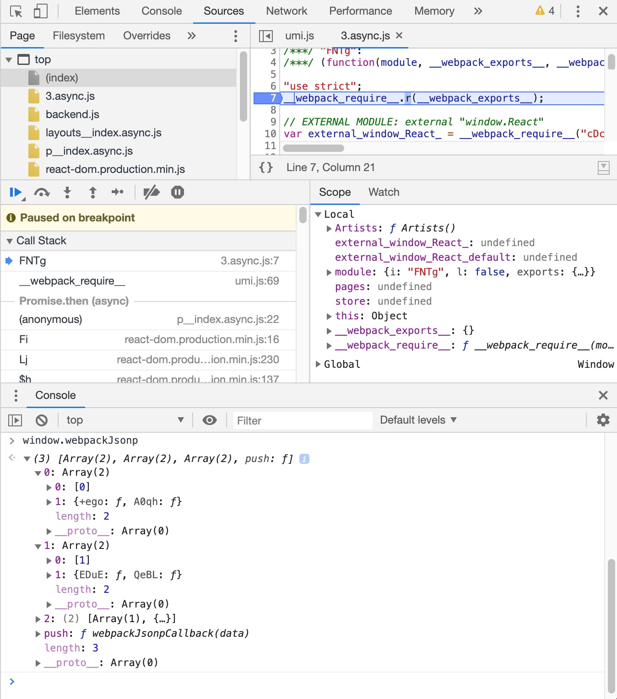

## ref
https://blog.bitsrc.io/lazy-loading-react-components-with-react-lazy-and-suspense-f05c4cfde10c

原文中使用的是 CRA 等脚手架，这里使用 umi

## steps

$ http-server # serve from dist/

## analysis
我们在 3.async.js 中打断点，可以看到 window.webpackJsonp 内部的数据结构，与预期是相符的：

相关 code-splitting 的技术实现解析可参考：
- https://medium.com/webpack/webpack-4-changes-part-1-week-24-25-fd4d77674e55
- https://github.com/webpack/webpack/tree/master/examples/code-splitting